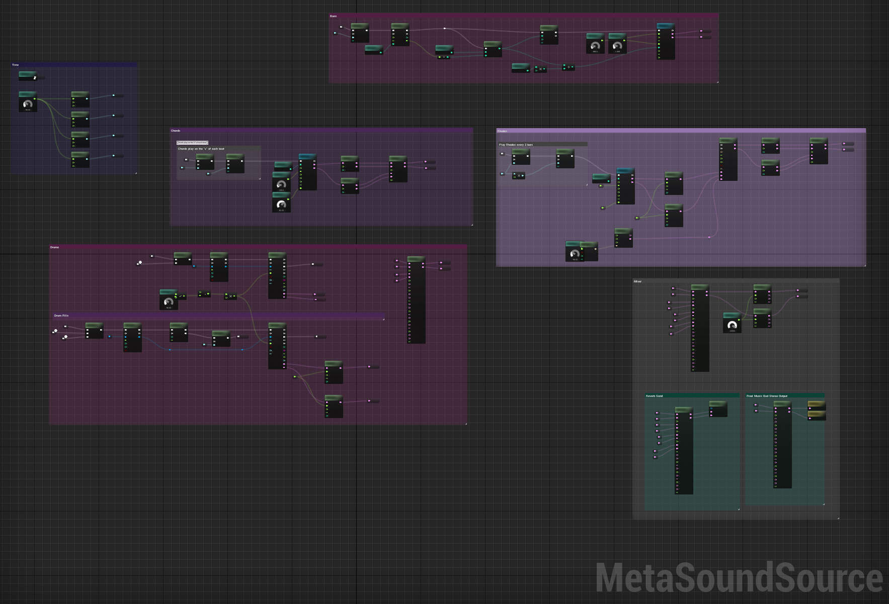

# RNBO MetaSounds

*This is experimental software—use at your own risk, and know that anything in this repository could change in the future.*

This repository will help you create custom nodes for a MetaSounds graph in Unreal Engine 5.3+ using RNBO's c++ source export. 

In addition to nodes which will hold your RNBO exports, this repository will also build utility nodes, for example, a `Transport` node which will help you utilize RNBO's built-in transport within your MetaSounds graph. 

### Example Project

To check out an example of an Unreal Engine project full of RNBO exports, download [this project](https://cycling74-assets.nyc3.digitaloceanspaces.com/rnbo/unreal-engine/example-projects/rnbo.metasounds.testproj-10.13.23.zip) and open up its `README.md`.

### Where to Put this Repository

To get started, clone this repository into your UE Project's `Plugins` directory, and check out [our documentation here](docs/README.md).

## Experimental State and Current Limitations

At this early stage in the developement of this tool, there exist some known limitations. Please feel free to add or comment on [issues](https://github.com/Cycling74/RNBOMetasound/issues) if you run into something you wish you could do, or something that seems like it is not working as you'd expect.

### Current Limitations

You can read more about each of the following topics in [our documentation](docs/README.md), including suggested current workarounds. 

* At present, you will not be able to use or set a `DataRef` (buffer) inside of the node built from your RNBO export.

* At present, `inport` and `outport` will only receive and transmit a `bang`, which is translated as a `Trigger` in MetaSounds. Float and list messages are [not currently implemented](docs/README.md#trigger).

* See our [issues page](https://github.com/Cycling74/RNBOMetasound/issues) for more discussion.

## Links

* [MetaSounds Reference Guide](https://docs.unrealengine.com/5.3/en-US/metasounds-reference-guide-in-unreal-engine/)
* [Unreal Build Tool](https://docs.unrealengine.com/5.3/en-US/unreal-build-tool-in-unreal-engine/)