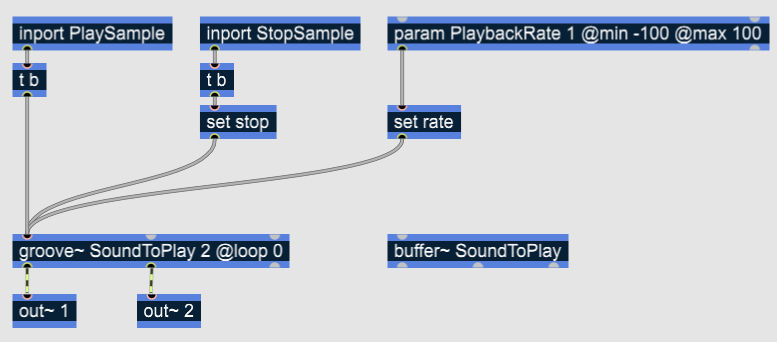
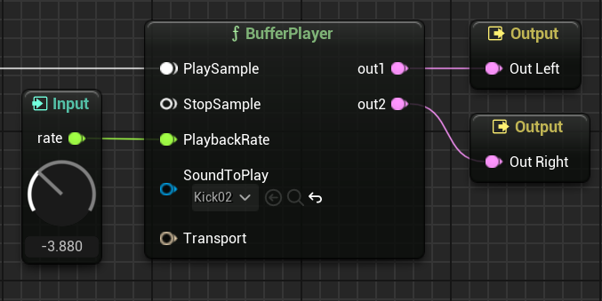

# Buffers in RNBO and Wave Assets

A named `{buffer~}` object in your RNBO patch will become a `WaveAsset` type pin on your MS node. 

Above, the `SoundToPlay` buffer which is being referenced by the `{groove~}` object will become an input pin on the resulting MS node. See below:

### Consideration regarding Buffers in your MS Node

- Making `WaveAsset` data available to the RNBO node is an async operation -- this data may not be available to the RNBO node immediately upon construction of the Metasound.

- The data for this `WaveAsset` is all loaded in RAM uncompressed. This might become an issue if you are working with large files. Also, each pin gets represents a unique copy of the data, so if you're mapping the same `WaveAsset` to two different pins, you get that data loaded in memory two times.

- Finally, note that we don't currently copy over the samples you may have loaded in your RNBO patch with `{buffer foo @file bar.aif}`. This enhancement is being tracked on [issue #29](https://github.com/Cycling74/RNBOMetasound/issues/29).

- Back to [Node I/O](NODE_IO.md)
- Next: [MIDI](MIDI.md)