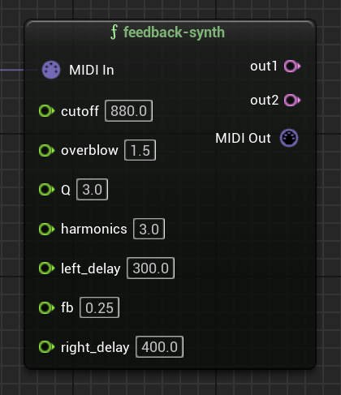

### MIDI

Including a `{midiin}` (or `{notein}`) object in your RNBO patch will generate a `MIDI In` input pin on your RNBO node. You can send data to that pin from a `MIDI Out` pin that you create from another export's `{midiout}` object, but there are also two utility nodes that will help you generate and manipulate MIDI in the MetaSounds graph itself.

You can also generate `MIDI In` and `MIDI Out` pins with RNBO's other MIDI input and output objects like `{ctrlin}` or `{ctrlout}`. For example, if you include a `{ctrlout}` object in a RNBO patcher, the node built from that export will be able to send MIDI CC messages into a `MIDI In` pin on a second RNBO node whose export included `{ctrlin}`.

#### Make Note

The `Make Note` node is very similar to RNBO's `{makenote}` object, but as a MetaSound node, it generates a note-on message from its `Trigger` input pin. Note that the `Duration` pin is of type `Time`.

#### MIDI Merge

Your RNBO patchers (and thus nodes) can be polyphonic. In order to send multiple MIDI note-on messages into a node at the same time, for example, to play a chord, you can use the `MIDI Merge` nodes, which take several MIDI type inputs and output them along a single patch cord. 

The `MIDI Merge` nodes have several versions, which you can select from depending on how many MIDI sources you'd like to merge. 

- Back to [Buffers and Wave Assets](BUFFERS.md)
- Next: [Transport - Global and Local](TRANSPORT.md)