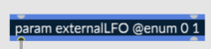
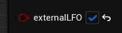

# Node I/O

## Audio Pin Naming

By default a pin for `{in~ 1}` or `{out~ 2}` will be named "in1" or "out2" but you can override that in 2 ways.

* `{in~ 1 @comment envelope}` will set the pin name to "envelope"
* `{in~ 1 @meta displayname:'my name'}` will set the pin name to "my name"
* `{in~ 1 @meta tooltip:'this is a tooltip'}` will set the pin tooltip to "this is a tooltip"

## Generating Pin Types

A RNBO patcher's `parameters`, message `inports` or `outports`, and `buffer~` objects can all become pins on the RNBO Metasound node, along with a pin for `MIDI` input/output and for connecting to a `Transport`. These objects can generate input pins, output pins, and in some cases, both. 

### Input and Output Parameters 

While an `inport` or `midiin` object in the RNBO patcher will necessarily create an input pin, and an `outport` or `midiout` object will create an output pin, parameters are more configurable. You can set whether a parameter of your RNBO patcher will become an input or an output pin using parameter metadata. 

* `{param foo}` or `{param foo @meta in:true}` will only create an input pin
* `{param foo @meta out:true}` will create both an input and an output pin
* `{param foo @meta in:false,out:true}` will only create an output pin

### Boolean

`{param foo @enum 0 1}` will be treated as a boolean type in the MS graph.

### Trigger
`{inport bar}` or `{output bar}` will create a `Trigger` input or output pin on the resulting MS node. 

Note that at present, the pin will only output a `Trigger` if the `outport` is set to output a `bang`.

### Enum

At present, `@enum` parameters are transformed into `Int` type pin in the MS node. A richer representation of these parameters is tracked on [issue #10](https://github.com/Cycling74/RNBOMetasound/issues/10).

### Other Pin Types

For more information, see the [Buffers](BUFFERS.md), [MIDI](MIDI.md), and [Transport](TRANSPORT.md) articles.

- Back to [Table Of Contents](README.md/#documentation-table-of-contents)
- Next: [Buffers and Wave Assets](BUFFERS.md)