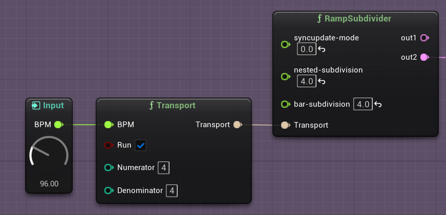
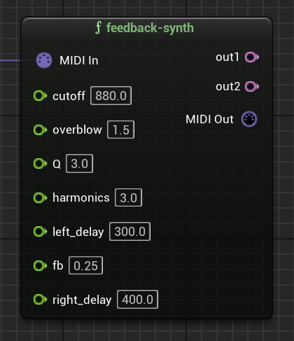
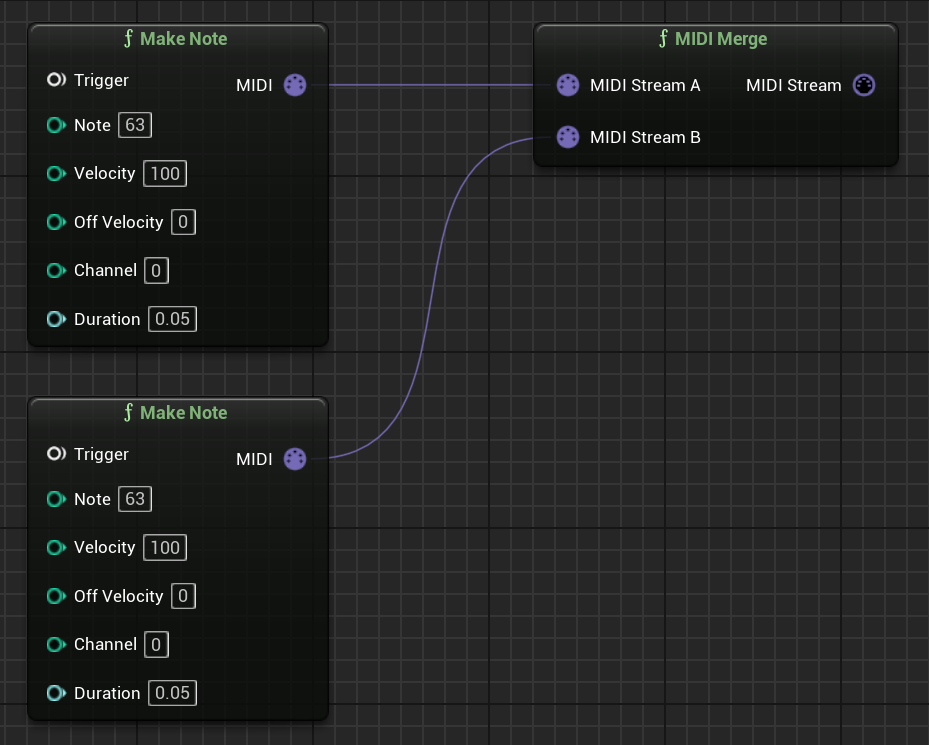

# RNBO MetaSounds Documentation

As this integration is in an experimental state, so is this documentation, and this guide should not be considered an encyclopedic reference, but rather a quick-start with a handful of ways to use this tool.

## Geting Started

1. You will need to create an `Exports/` directory to hold your RNBO exports. 
2. Place `Exports/` inside this repository root directory, with a path like: `/<Your UE Project>/Plugins/RNBOMetasound/Exports/`
3. Give each RNBO patch a unique `Export Name` and `Classname`
4. Create a folder inside `Exports/` for each exported RNBO patch, like `Exports/<Your RNBO Device Name>/`
5. Export your c++ source code export to the folder you create in step 4. 
6. After you export, you must build your project. Your UE project should be a C++ project so that you can generate a Visual Studio solution or Xcode project for your game.

## Generating Pin Types

A RNBO patcher's `parameters` and message `inports` or `outports` can all become pins on the RNBO Metasound node, along with a pin for `MIDI` input/output and for connecting to a `Transport`. Those pins can be input pins, output pins, or both. 

### Input and Output Parameters 

While an `inport` or `midiin` object in the RNBO patcher will necessarily create an input pin, and an `outport` or `midiout` object will create an output pin, parameters are more configurable. You can set whether a parameter of your RNBO patcher will become an input or an output pin using parameter metadata. 

* `[param foo]` will create an input pin
* `[param foo @meta in:true]` will only create an input pin
* `[param foo @meta out:true]` will create both an input and an output pin
* `[param foo @meta in:false,out:true]` will only create an output pin

### Boolean

`[param foo @enum 0 1]` will be treated as a boolean type in the MS graph.

### Trigger
`[inport bar]` or `[output bar]` will create a `Trigger` input or output pin on the resulting MS node. 

Note that at present, the pin will only output a `Trigger` if the `outport` is set to output a `bang`.

## Utility Nodes

This repository will build a few utility nodes that are designed to help you work with MIDI and RNBO's internal transport. 

### Transport

The RNBO MetaSound node has an input pin that takes the `Transport` type. The `Transport` node, shown in the image above, allows you to set the BPM, time signature numerator and denominator, and whether the transport is running or not.

### MIDI

As stated above, including a `[midiin]` (or `[notein]`) object in your RNBO patch will generate a `MIDI In` input pin on your RNBO node. You can send data to that pin from a `MIDI Out` pin that you create from another export's `[midiout]` object, but there are also two utility nodes that will help you generate and manipulate MIDI in the MetaSounds graph itself.

#### Make Note

The `Make Note` node is very similar to RNBO's `[makenote]` object, but as a MetaSound node, it generates a note-on message from its `Trigger` input pin. Note that the `Duration` pin is of type `Time`.

#### MIDI Merge

Your RNBO patchers (and thus nodes) can be polyphonic. In order to send multiple MIDI note-on messages into a node at the same time, for example, to play a chord, you can use the `MIDI Merge` nodes, which take several MIDI type inputs and output them along a single patch cord. 

The `MIDI Merge` nodes have several versions, which you can select from depending on how many MIDI sources you'd like to merge. 

## A note on buffers and audio files

At present, external buffers referenced by RNBO patchers are not yet supported in the RNBO-built MetaSound node. 

