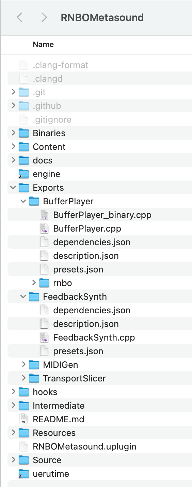

# RNBO MetaSounds Documentation

As this integration is in an experimental state, so is this documentation, and this guide should not be considered an encyclopedic reference, but rather a quick-start with a handful of ways to use this tool.

## Example project 

Further documentation can be found in the form of our demo project. Download [the project here](https://assets.cycling74.com/rnbo/unreal-engine/example-projects/rnbo.metasounds.testproj-08.13.24.zip) and open up its `README.md` to get started.

## Geting Started

1. You will need to create an `Exports/` directory to hold your RNBO exports. 
2. Place `Exports/` inside this repository root directory, with a path like: `/<Your UE Project>/Plugins/RNBOMetasound/Exports/`
3. Give each RNBO patch a unique `Export Name` and `Classname`
4. Create a folder inside `Exports/` for each exported RNBO patch, like `Exports/<Your RNBO Device Name>/`
5. Export your c++ source code export to the folder you create in step 4. 
6. After you export, you must build your project. Your UE project should be a C++ project so that you can generate a Visual Studio solution or Xcode project for your game.

### Naming your RNBO Node

Your RNBO MetaSound node will be named by your top-level `[rnbo~]` object’s `@title` attribute or, if no such value exists, by the `Classname` you’ve defined in the export sidebar.

### Multiple Exported Patchers
You will probably have multiple RNBO exports. Your `RNBOMetasound/` directory might end up looking something like:

In this example, `BufferPlayer`, `FeedbackSynth`, `MIDIGen`, and `TransportSlicer` are all individual RNBO exports.

## Documentation Table of Contents

Your MetaSound node will have input and output pins built from your RNBO patch's parameters, inport/outports, buffers, MIDI and Transport objects. In addition to your custom node, this plugin will also build several utility nodes that helps you access some of RNBO's features in the MetaSound graph editor. 

- [Node Pins and I/O: types and naming](NODE_IO.md)
- [Buffers and Wave Assets](BUFFERS.md)
- [MIDI](MIDI.md)
- [Transport - Global and Local](TRANSPORT.md)

