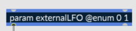

# RNBO MetaSounds Documentation

As this integration is in an experimental state, so is this documentation, and this guide should not be considered an encyclopedic reference, but rather a quick-start with a handful of ways to use this tool.

## Example project 

Further documentation can be found in the form of our demo project. Download [the project here](https://cycling74-assets.nyc3.digitaloceanspaces.com/rnbo/unreal-engine/example-projects/rnbo.metasounds.testproj-10.13.23.zip) and open up its `README.md` to get started.

## Geting Started

1. You will need to create an `Exports/` directory to hold your RNBO exports. 
2. Place `Exports/` inside this repository root directory, with a path like: `/<Your UE Project>/Plugins/RNBOMetasound/Exports/`
3. Give each RNBO patch a unique `Export Name` and `Classname`
4. Create a folder inside `Exports/` for each exported RNBO patch, like `Exports/<Your RNBO Device Name>/`
5. Export your c++ source code export to the folder you create in step 4. 
6. After you export, you must build your project. Your UE project should be a C++ project so that you can generate a Visual Studio solution or Xcode project for your game.

## Naming your RNBO Node

Your RNBO MetaSound node will be named by your top-level `[rnbo~]` object’s `@title` attribute or, if no such value exists, by the `Classname` you’ve defined in the export sidebar.

## Audio Pin Naming

By default a pin for `[in~ 1]` or `[out~ 2]` will be named "in1" or "out2" but you can override that in 2 ways.

* `[in~ 1 @comment envelope]` will set the pin name to "envelope"
* `[in~ 1 @meta displayname:'my name']` will set the pin name to "my name"
* `[in~ 1 @meta tooltip:'this is a tooltip']` will set the pin tooltip to "this is a tooltip"

## Generating Pin Types

A RNBO patcher's `parameters`, message `inports` or `outports`, and `buffer~` objects can all become pins on the RNBO Metasound node, along with a pin for `MIDI` input/output and for connecting to a `Transport`. These objects can generate input pins, output pins, and in some cases, both. 

### Input and Output Parameters 

While an `inport` or `midiin` object in the RNBO patcher will necessarily create an input pin, and an `outport` or `midiout` object will create an output pin, parameters are more configurable. You can set whether a parameter of your RNBO patcher will become an input or an output pin using parameter metadata. 

* `[param foo]` or `[param foo @meta in:true]` will only create an input pin
* `[param foo @meta out:true]` will create both an input and an output pin
* `[param foo @meta in:false,out:true]` will only create an output pin

### Boolean

`[param foo @enum 0 1]` will be treated as a boolean type in the MS graph.

### Trigger
`[inport bar]` or `[output bar]` will create a `Trigger` input or output pin on the resulting MS node. 

Note that at present, the pin will only output a `Trigger` if the `outport` is set to output a `bang`.

### WaveAsset

A named buffer in a RNBO patch will generate an input pin of `WaveAsset` type. 

Note that making `WaveAsset` data available to the RNBO node is an async operation, and that this data may not be available to the RNBO node immediately upon construction of the Metasound.

## Utility Nodes

This repository will build a few utility nodes that are designed to help you work with MIDI and RNBO's internal transport. 

### Transport

The RNBO MetaSound node has an input pin that takes the `Transport` type. The `Transport` node, shown in the image above, allows you to set the BPM, time signature numerator and denominator, and whether the transport is running or not.

### MIDI

As stated above, including a `[midiin]` (or `[notein]`) object in your RNBO patch will generate a `MIDI In` input pin on your RNBO node. You can send data to that pin from a `MIDI Out` pin that you create from another export's `[midiout]` object, but there are also two utility nodes that will help you generate and manipulate MIDI in the MetaSounds graph itself.

Though there are not yet utility nodes built for this purpose, you can also generate `MIDI In` and `MIDI Out` pins with RNBO's other MIDI input and output objects like `[ctrlin]` or `[ctrlout]`. For example, if you include a `[ctrlout]` object in a RNBO patcher, the node built from that export will be able to send MIDI CC messages into a `MIDI In` pin on a second RNBO node whose export included `[ctrlin]`.

#### Make Note

The `Make Note` node is very similar to RNBO's `[makenote]` object, but as a MetaSound node, it generates a note-on message from its `Trigger` input pin. Note that the `Duration` pin is of type `Time`.

#### MIDI Merge

Your RNBO patchers (and thus nodes) can be polyphonic. In order to send multiple MIDI note-on messages into a node at the same time, for example, to play a chord, you can use the `MIDI Merge` nodes, which take several MIDI type inputs and output them along a single patch cord. 

The `MIDI Merge` nodes have several versions, which you can select from depending on how many MIDI sources you'd like to merge. 