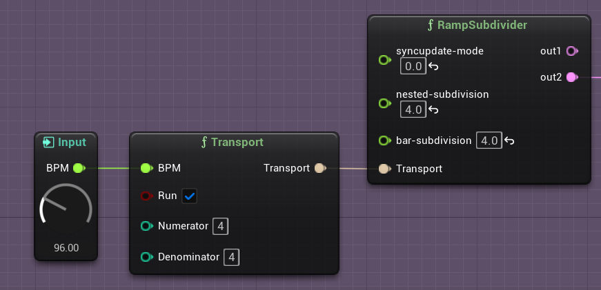

# The RNBO Transport in Unreal Engine

The RNBO MetaSound node has an input pin that takes the `Transport` type. The `Transport` node, shown in the image above, allows you to set the BPM, time signature numerator and denominator, and whether the transport is running or not.

## Global Transport

RNBO's Global Transport provides a solution for synchronizing various running MetaSounds. Any instances of the `Global Transport` node, as opposed to the `Transport` node, share state across active MetaSounds. 

There should only ever be one active instance of a `Global Transport Control` node running in your project. Using this node, you can set the `BPM`, running state, and the `Numerator` and `Denominator` of the time signature for RNBO's transport. 

Once you've set these input parameters, you can apply, or `Latch` those values to the global transport with a trigger sent to the `Latch` input pin.

Additionally, you can set a `BeatTime`, defined in quarter notes since the start of the transport (beat "one"), and then `Seek` to that location by sending a trigger to the `Seek` input pin.

## Transport Get

You can get the `bool` running state, `float` beats per minute, and `int` current beat, bar, and tick, and time signature of a Transport using the `Transport Get` node. 

- Back to [MIDI](MIDI.md)
- Return to [Table Of Contents](README.md/#documentation-table-of-contents)